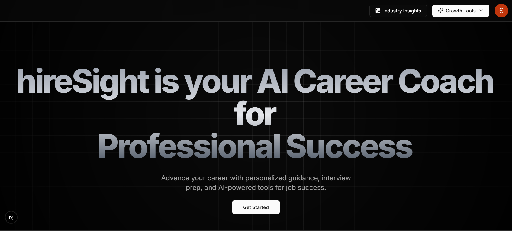
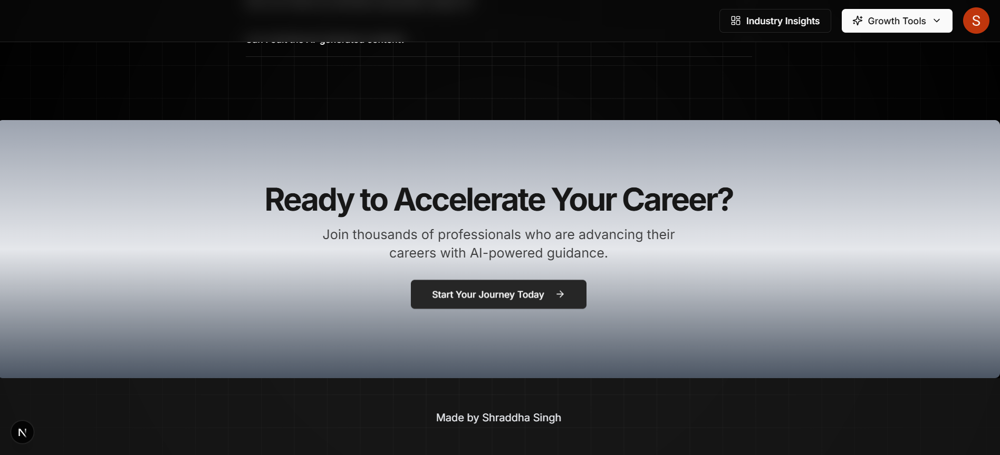

# 🧠 Hiresight – AI Career Coach Platform

Hiresight is an intelligent, full-stack AI-powered career coach built with modern web technologies. It helps users elevate their job readiness through personalized **resume building**, **industry insights**, **mock interview preparation**, and **AI-generated cover letters** – all in one seamless platform.

 

---

## 🚀 Tech Stack

- **Frontend:** Next.js 14, React, TypeScript, Tailwind CSS, Shadcn UI  
- **Backend:** Prisma ORM, PostgreSQL  
- **AI:** Google Gemini API (Generative AI for career insights & mock interviews)  
- **Workflow:** Inngest (for background jobs like weekly insights)  
- **Authentication:** NextAuth.js  
- **Deployment:** Vercel

---

## 🧩 Features

### 🎯 Career Launchpad
- Personalized **user onboarding**
- AI-driven **industry trends & demand analytics**

### 🤖 Mock Interview Coach
- Generates real-time, role-specific interview questions via **Gemini AI**
- Interactive UI for answering and viewing performance stats

### 📄 AI Resume Builder
- Markdown-powered resume editor
- Instant **PDF downloads**
- AI-generated **cover letters**

### 🔁 Weekly Career Insights (Cron + Inngest)
- Users receive **automated weekly updates** based on industry demand

---

## 📸 Screenshots

### 🖥️ Screenshot Preview

> _

---

